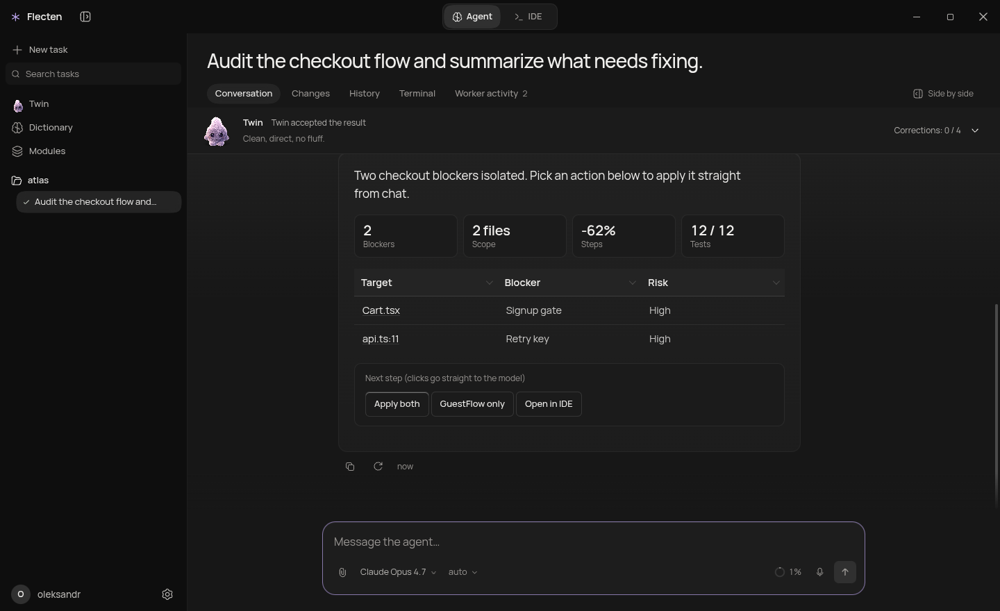
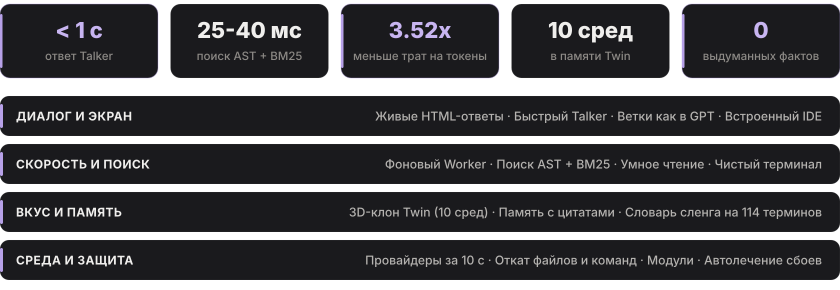
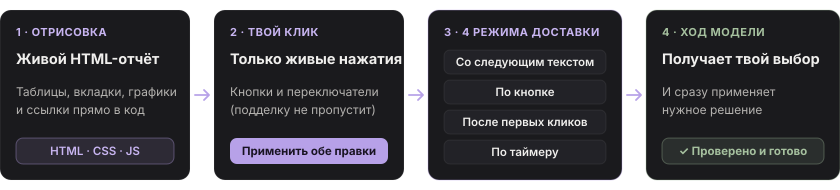
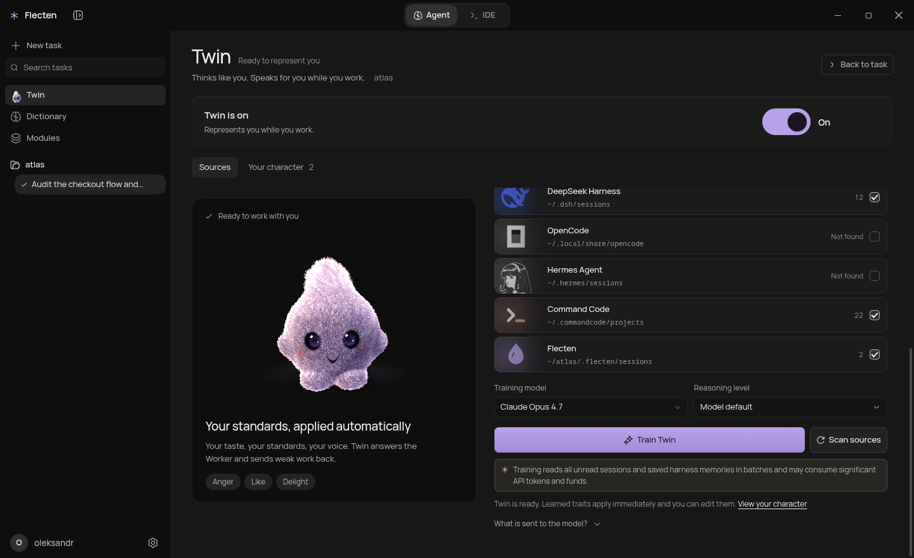
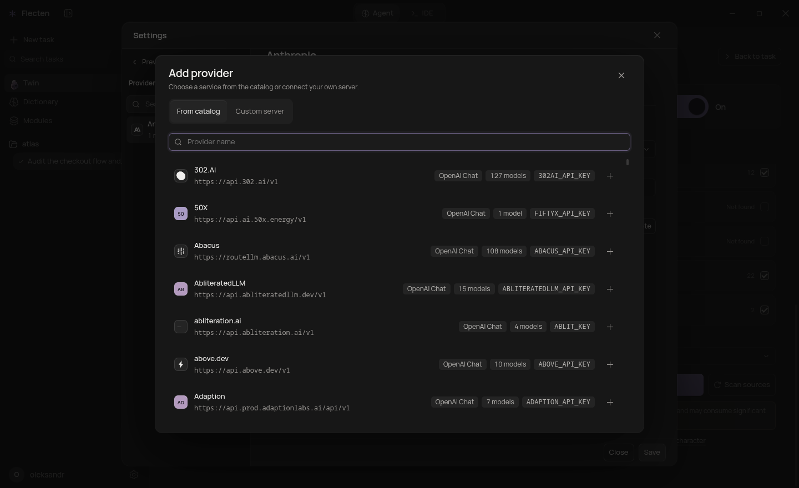
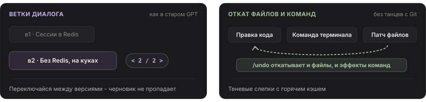

<div align="center">

<picture>
  <source media="(prefers-color-scheme: dark)" srcset="../assets/readme/hero-ru-dark.svg">
  <source media="(prefers-color-scheme: light)" srcset="../assets/readme/hero-ru-light.svg">
  
</picture>

<p>
  <a href="../../CHANGELOG.md"></a>
  <a href="../../LICENSE"></a>
  
  <a href="../../README.md"></a>
</p>

<p><strong>Общайся с агентом на скорости своей мысли, пока код пишется, проверяется и правится в фоне.</strong><br>
Живые HTML-приложения прямо в ответах, 3D-клон твоего вкуса, который не даёт агенту халтурить, и снайперский поиск в нужную функцию с первого хода.</p>

<br>



<br><br>

<picture>
  <source media="(prefers-color-scheme: dark)" srcset="../assets/readme/glance-ru-dark.svg">
  <source media="(prefers-color-scheme: light)" srcset="../assets/readme/glance-ru-light.svg">
  
</picture>

</div>

| | | |
| :--- | :--- | :--- |
| **[Живые HTML-ответы](#живые-html-ответы)**<br>Кликабельные таблицы, вкладки, фильтры и кнопки, после которых агент сразу действует. | **[Talker и Worker](#talker-и-worker)**<br>Чат отзывается быстрее секунды и не зависает, пока правки и тесты бегут в фоне. | **[Twin (3D-клон тебя)](#twin)**<br>Вытаскивает твой характер из 10 ИИ-сред и врывается в чат, если агент халтурит. |
| **[Снайперский поиск и скорость](#снайперский-поиск-и-скорость)**<br>Поиск AST + BM25, умное чтение функций, общая память чтений, ~90% кэша промпта. | **[Повседневный поток](#повседневный-поток)**<br>Провайдеры за 10 секунд, ветки чата как в старом GPT, откат файлов и команд, IDE внутри. | **[Глубоко под капотом](#глубоко-под-капотом)**<br>Горячие модули, честная память с цитатами без выдумок, словарь сленга на 114 терминов. |

<br>

<p align="center">
  <picture>
    <source media="(prefers-color-scheme: dark)" srcset="../assets/readme/strip-html-ru-dark.svg">
    <source media="(prefers-color-scheme: light)" srcset="../assets/readme/strip-html-ru-light.svg">
    
  </picture>
</p>

## Живые HTML-ответы

Обычные ИИ-харнессы вываливают простыню текста, и дальше ты руками ищешь файлы по путям или пишешь «да, делай второй вариант». В Flecten модель собирает прямо внутри ответа **живой интерактивный мини-интерфейс**: таблицы с сортировкой и фильтром, вкладки для сравнения вариантов, графики, ползунки, галочки и кнопки действий.

И это не просто красивая картинка. Это **полноценная двусторонняя связь между тобой и моделью**:

- **Нажал в отчёте, сдвинул задачу:** Выбери в карточке нужные правки, переключи тумблер или нажми кнопку. Твои реальные действия улетают обратно в сессию, и агент сразу берёт выбранное решение в работу без лишних переспросов.
- **Четыре умных ритма отправки:** Карточка умеет тихо ждать твоего следующего сообщения, срабатывать мгновенно по кнопке, отправляться после первых кликов или запускать короткий таймер.
- **Только живые человеческие нажатия:** Оболочка на границе проверяет каждое действие как настоящий клик пользователя. Ни один скрипт внутри отчёта не сможет подделать согласие или нажать кнопку за тебя.
- **Прыжок из таблицы прямо в строку кода:** Ссылка на файл открывает нужную строку во встроенном IDE или ведёт в конкретный раздел настроек.
- **Жёсткая изоляция без сети:** Каждая карточка живёт в отдельной песочнице без выхода в интернет, без доступа к основному окну и без доступа к диску. При этом отчёт начинает рисоваться ещё во время набора и тратит на `-65%` меньше выходных токенов, чем громоздкие дашборды.

<p align="center">
  <picture>
    <source media="(prefers-color-scheme: dark)" srcset="../assets/readme/flow-html-ru-dark.svg">
    <source media="(prefers-color-scheme: light)" srcset="../assets/readme/flow-html-ru-light.svg">
    
  </picture>
</p>

---

## Talker и Worker

В однокнопочных харнессах даже короткий вопрос встаёт в тупик, если агент сейчас перелопачивает проект. Приходится ждать окончания всех шагов, либо жать стоп и терять половину разгона.

Flecten разделяет разговор и чёрную работу на двух партнёров:

- **Talker всегда на связи (`< 1 с`):** Переводит твою короткую просьбу в чёткое задание с точными цитатами, мгновенно отвечает на вопросы и собирает красивые HTML-отчёты, вообще не блокируя поле ввода.
- **Worker пашет в фоне:** Читает код, патчит файлы, поднимает параллельных подагентов, гоняет тесты и отдаёт живые карточки прогресса наверх, не вешая диалог.
- **Правка курса прямо на лету:** Передумал по ходу дела и написал уточнение? Talker моментально переведёт его в точечную команду для работающего Worker без перезапуска сессии и без обрыва горячего кэша.
- **Сжатие этапов без халтуры:** На крупных шагах Worker уплотняет длинный хвост проверок в чистый итог с опорой на реальные факты. Незакрытую задачу не получится тихо объявить готовой.

<p align="center">
  <picture>
    <source media="(prefers-color-scheme: dark)" srcset="../assets/readme/flow-talker-worker-ru-dark.svg">
    <source media="(prefers-color-scheme: light)" srcset="../assets/readme/flow-talker-worker-ru-light.svg">
    
  </picture>
</p>

---

## Twin


**Надоело в каждой новой сессии заново объяснять: «не плоди лишние обёртки», «сделай один экран без мастера настройки» и «сначала прогони настоящие тесты»?** Twin снимает эту рутину раз и навсегда. Он бережно переносит твой реальный вкус, манеру речи и жёсткие стандарты из истории **10 ИИ-сред** на твоём компьютере: Claude Code, Codex, Cursor, OpenCode, Oh-My-Pi, Gemini CLI, Kilo Code, DeepSeek CLI, Command Code и самого Flecten.

Сначала всё локально сканируется и очищается от повторов (до **50 000 сообщений**), после чего формируется живой профиль до **200 правил**, где каждое привязано к твоей дословной цитате и силе эмоции (от одобрения и восторга до лютого бешенства). Каждое правило можно поправить или включить под конкретный проект. Во время работы Twin тихо наблюдает в фоне и не тормозит шаги. Но если агент полез не туда или решил схалтурить, Twin не оставляет унылую строчку в логе: он **врывается прямо в чат твоим голосом** в пушистом 3D-пузыре и заставляет переделать по-человечески.

<br clear="all">

<p align="center">
  
</p>

<br>

<p align="center">
  
</p>

<br>

<p align="center">
  
</p>

<br>

<p align="center">
  <picture>
    <source media="(prefers-color-scheme: dark)" srcset="../assets/readme/strip-search-ru-dark.svg">
    <source media="(prefers-color-scheme: light)" srcset="../assets/readme/strip-search-ru-light.svg">
    
  </picture>
</p>

## Снайперский поиск и скорость

Обычные агенты сливают первые пять шагов на блуждание по тестам, чейнджлогам и случайным совпадениям, пока наконец не найдут живой код. В Flecten поиск и подача контекста устроены так, чтобы попадать в нужное место с первого выстрела и держать промпт-кэш прогретым.

- **Понимает составные имена по смыслу:** Как бы ни назывались сущности в проекте (слитно, через подчёркивания или дефисы), поиск раскладывает имена на смысловые части, а для точных символов или фраз сам переключается на быстрый буквальный проход.
- **Поднимает живой код выше тестов и доков:** Реальные объявления функций, классов и типов взлетают в самую верхушку выдачи, пока тесты, заглушки и документация спокойно уходят вниз.
- **Сразу разворачивает тело главных находок:** Для трёх самых точных совпадений Flecten сразу показывает целиком окружающую функцию прямо в ответе поиска. Агенту чаще всего даже не нужно тратить отдельный ход на чтение файла (`25-40 мс` на весь поиск).
- **Умное чтение по границам функций и общая память чтений:** Файлы открываются по целым логическим блокам, не обрываясь на полуслове. При параллельной работе подагенты видят общую карту уже прочитанного: неизменившийся код заменяется короткой пометкой вместо повторной простыни.
- **Чистый терминал и горячий кэш:** Бесконечные прогресс-бары, цветная мишура и повторяющийся шум терминала срезаются ещё до отправки модели, а живые меняющиеся данные вынесены за стабильную границу префикса, поэтому `~90%` входного контекста стабильно сидит в кэше.

<p align="center">
  <picture>
    <source media="(prefers-color-scheme: dark)" srcset="../assets/readme/flow-search-ru-dark.svg">
    <source media="(prefers-color-scheme: light)" srcset="../assets/readme/flow-search-ru-light.svg">
    
  </picture>
</p>

### Что это даёт в цифрах

| Показатель | Обычный харнесс | Flecten | Выигрыш |
| :--- | :--- | :--- | :--- |
| **Свежие некэшированные токены** | Повторные прогоны одних и тех же файлов | Общая память чтений + стабильный префикс | **В `3.52x` меньше трат** |
| **Скорость на сложных правках** | Один файл за шаг и ожидание по очереди | Пакетные вызовы + готовые функции в поиске | **До `4.33x` быстрее** *(реальный замер · v0.1.5)* |
| **Время точного поиска** | 4-6 пустых ходов по тестам и докам | Ранжирование AST + BM25 + 3 тела сразу | **`25-40 мс` · попадание с 1 хода** |
| **Попадание в кэш промпта** | Динамика сбивает префикс на каждом ходу | Стабильный словарь и ядро до границы кэша | **`~90%` в кэше** *(В теории / по замерам)* |
| **Вес отчётов ответа** | Длинные простыни таблиц и текста | Компактные теги, раскрытые в окне отчёта | **`-65%` токенов на отчёты** |

<br>

<p align="center">
  <picture>
    <source media="(prefers-color-scheme: dark)" srcset="../assets/readme/strip-workspace-ru-dark.svg">
    <source media="(prefers-color-scheme: light)" srcset="../assets/readme/strip-workspace-ru-light.svg">
    
  </picture>
</p>

## Повседневный поток

### Подключение любого провайдера за 10 секунд

Забудь про ручную возню с конфигами. Выбери нужный сервис из встроенного живого каталога (с уже подтянутыми моделями, ценами и возможностями), подключи локальные серверы (Ollama, LM Studio, vLLM, LocalAI), которые Flecten находит на машине сам, или вбей свой адрес. Если сидишь за строгим шлюзом без списка моделей, просто выключи автопроверку и добавь модель в два клика.

<p align="center">
  
</p>

---

### Ветки диалога как в старом GPT + откат файлов и команд


**Решил пойти другим путём или сравнить два подхода к архитектуре?** Отредактируй любое прошлое сообщение ровно так, как это было удобно в старом интерфейсе GPT, и отпочкуй новую ветку диалога. Переключайся туда-сюда стрелками `< 1 / 2 >` в любое время: старая ветка и даже недописанный черновик внизу никуда не пропадают.

А если команда в терминале наломала дров, Flecten не разводит руками со словами «это было вне Git». Теневые слепки отслеживают **не только правки файлов, но и эффекты команд терминала** полностью независимо от Git: команды `/undo` и `/redo` чисто отматывают назад и то, и другое, опираясь на горячий кэш слепков без задержек на переключение.

<br clear="all">

<p align="center">
  <picture>
    <source media="(prefers-color-scheme: dark)" srcset="../assets/readme/flow-timemachine-ru-dark.svg">
    <source media="(prefers-color-scheme: light)" srcset="../assets/readme/flow-timemachine-ru-light.svg">
    
  </picture>
</p>

<br>

<p align="center">
  
</p>

---

### Встроенный полноценный IDE в один клик

Не нужно постоянно скакать в соседний редактор ради трёх строк или просмотра диффа. Нажми **IDE** сверху по центру (или кликни на любую ссылку прямо в HTML-отчёте), и перед тобой дерево файлов, редактор с подсветкой, разбор изменений агента, комментарии прямо к строкам, живые терминалы и чат справа на одной удобной панели.

<p align="center">
  
</p>

<br>

<p align="center">
  <picture>
    <source media="(prefers-color-scheme: dark)" srcset="../assets/readme/strip-deep-ru-dark.svg">
    <source media="(prefers-color-scheme: light)" srcset="../assets/readme/strip-deep-ru-light.svg">
    
  </picture>
</p>

## Глубоко под капотом

### Горячие модули, которые меняют даже сам интерфейс

Нужны свои инструменты, автоматические проверки, хуки или управление рабочим столом (`Computer Use` со снимками экрана, кликами мыши и вводом с клавиатуры)? Подкинь модуль во Flecten и включи его прямо на лету без перезапуска программы и без поломки промпт-кэша. Модули умеют подменять даже **весь пользовательский интерфейс приложения целиком**, позволяя кастомизировать или собирать поверх Flecten свои оболочки без форка ядра.

---

### Честная память с проверкой по цитатам

Большинство систем «памяти ИИ» гоняют в фоне отдельного бота, который после каждого чата додумывает за тобой привычки и со временем превращается в кашу из противоречий. В Flecten этот узел спроектирован максимально честно и жёстко:

- **Никаких фоновых фантазёров:** В память пишет только сам ведущий агент: строго по твоему явному запросу или когда звучит долгосрочное правило для проекта. Случайный трёп туда не лезет.
- **Сверка байт в байт с реальной цитатой:** Каждая запись обязана ссылаться на точную строку, которую ты реально писал в этом или прошлом диалоге. Если модель не может опереться на живые слова, хранилище не примет запись.
- **Замена устаревших правил вместо помойки:** Сменил базу данных, тестовый движок или правило оформления? Новая договорённость аккуратно замещает старую, а не копит конфликтующие инструкции.
- **Блокировка секретов и полный обзор:** Ключи API, пароли и токены отсеиваются ещё до сохранения. А всю базу памяти видно в одном чистом списке настроек: любой пункт можно поправить или удалить.

---

### Словарь сленга и битой раскладки за 0 мс

Каждый разработчик бросает короткое «сделай по красоте», «поправь логику» или просто забывает переключить раскладку и шлёт `ghbdtn` или `rfr ltkf?`. Во Flecten уже вшит **словарь на 114 разработческих терминов** под русский, украинский и английский сленг плюс мгновенная починка текста с неправильной раскладки за **0 мс** прямо на входе. Туда же можно вписать внутренние сокращения своей команды, чтобы модель понимала тебя с полуслова без лишних уточнений и лишних токенов.

---

## Что ещё уже внутри

| Возможность | Чем выручает каждый день |
| :--- | :--- |
| **Голосовой ввод (`Ctrl+Shift+V`)** | Диктуй задачи вслух через локальный Whisper или Groq с автоочисткой слов-паразитов ([дока](../VOICE.md)). |
| **Фоновый перевод без потери ума** | Пиши на родном языке: Flecten переводит тяжелые инженерные рассуждения на английский в фоне и возвращает чистый ответ тебе. |
| **Параллельные подагенты** | Запускай сразу несколько независимых разведчиков, исполнителей и ревьюеров с отдельными правами на инструменты. |
| **Системная песочница (OS Sandbox)** | Изолирует команды терминала на уровне ОС (`bubblewrap` / `Seatbelt` / права Windows) с чётким списком разрешённых папок. |
| **7 языков интерфейса** | Полная локализация оболочки: русский, английский, украинский, испанский, португальский, японский и китайский. |
| **Подписанные дельта-обновления** | Проверенные подписью Cosign установщики и компактные обновления (`stable`, `beta`, `alpha`) прямо из приложения. |

---

## Непробиваемая устойчивость

Провайдеры зависают, рвут поток на полуслове, упираются в лимиты и ломают JSON. Flecten молча заглатывает эти сбои без обрыва работы:

- **Автовосстановление стрима:** Видит оборванные аргументы, пустые ответы и зацикленные рассуждения, сам переподключается и мягко дожимает шаг.
- **Умный перебор и карантин (Failover):** Если точка отвалилась или словила лимит, перескакивает на резервную модель и временно отправляет проблемного провайдера остывать, не списывая лишнее со счёта за сбойные ходы.
- **Самолечение мелких правок:** Слегка уплывшие отступы или переносы строк автоматически подгоняются по нечёткому совпадению, не роняя весь патч.
- **Бережная защита окна контекста:** Гигантские логи, бинарники и зацикленные выводы аккуратно обрезаются на входе, чтобы ни одна случайная команда не переполнила контекст.

---

## Быстрый старт

### Вариант 1: Готовый установщик (проще всего)

Скачай сборку под свою систему в разделе [GitHub Releases](https://github.com/AnnenkovLabs/flecten/releases):
- **Windows:** установщик `.exe`
- **Linux:** `.AppImage` или `.deb`
- **macOS:** образ `.dmg`

### Вариант 2: Сборка и запуск из исходников

Нужен **[Bun](https://bun.sh) 1.4.4+**:

```bash
git clone https://github.com/AnnenkovLabs/flecten.git
cd flecten
bun install
bun run app:dev
```

<details>
<summary>Обновляешься с Liquid Harness?</summary>

Все проекты из `~/.liquidharness`, `.liquidharness/` и `liquid.config.json` автоматически распознаются и аккуратно переезжают в `.flecten/` и `flecten.config.json` при первом запуске.

</details>

---

## Документация

| Раздел | О чём внутри |
| :--- | :--- |
| [Twin](../TWIN.md) | 3D-клон твоего вкуса, импорт из 10 сред, наблюдение и перехват |
| [Talker и Worker](../TALKER-WORKER.md) | Два агента в паре, управление на лету, проверка готовности |
| [Память](../MEMORY.md) | Долговременная память с проверкой цитат и защитой от секретов |
| [Словарь](../DICTIONARY.md) | Моментальная расшифровка сленга и битой раскладки |
| [Модули](../MODULES.md) | Горячие плагины, свои инструменты и замена интерфейса |
| [Computer Use](../COMPUTER-USE.md) | Модуль управления экраном, мышью и клавиатурой |
| [Голос](../VOICE.md) | Диктовка по горячей клавише через Whisper и Groq |
| [Защита провайдеров](../PROVIDER-PROTECTION.md) | Перебор резервов, карантин и защита бюджета |
| [Бенчмарки](../BENCHMARK.md) | Сравнительные замеры скорости и расхода токенов |
| [Архитектура](../ARCHITECTURE.md) | Устройство слоёв, границ доверия и безопасности |

<div align="center">

<br>


Лицензия **[AGPL-3.0](../../LICENSE)** · Команда [AnnenkovLabs](https://github.com/AnnenkovLabs/flecten) · [История версий](../../CHANGELOG.md)

</div>
